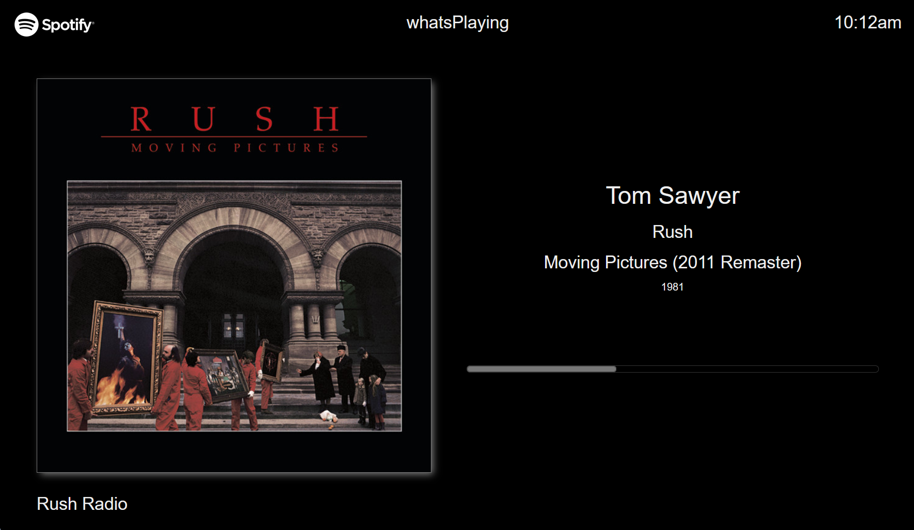
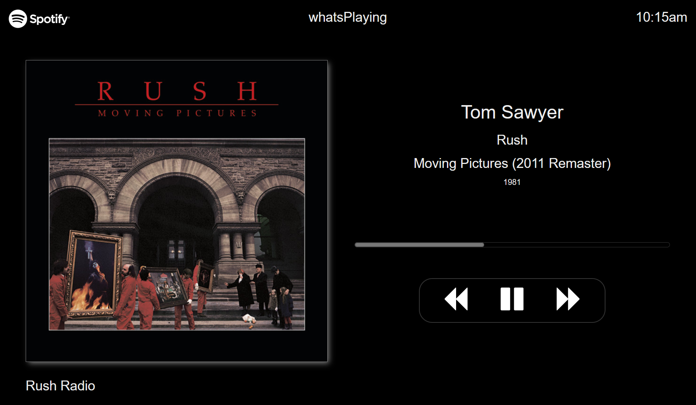
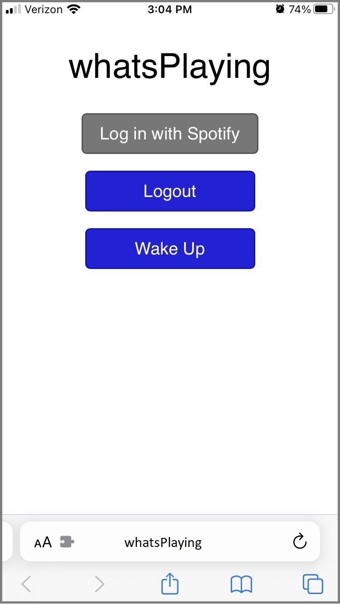
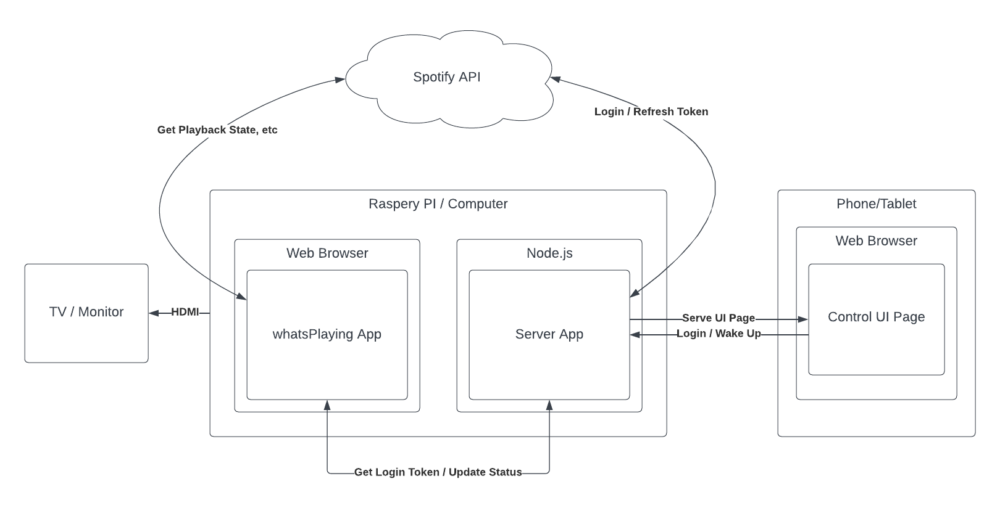

# whatsPlaying
whatsPlaying is an app that displays "what's playing" on your Spotify account.

Sometimes you want to know the current song that's playing, or the artist, or maybe what year the song was, all without constantly popping your phone in and out of your pocket.  This is especially true if you're playing a Spotify radio station, or if you have friends over who are curious what you're listening to.

Depending on your audio setup, it may or may not be easy/convenient to see what's playing on Spotify.  Smart TV apps usually only show a "now playing" screen if Spotify is actually playing ON that TV.  Sonos has no display other than your phone/tablet.  A/V systems are hit or miss with providing a decent (or any) display to your TV.

## The App
The app runs in a browser and will display information about the current song you're playing in Spotify, including the radio station you're listening to.  It also displays a progress bar and a clock showing the current time of day.



If you have a touch screen, you can also enable play controls



Login and control happens on your phone, not the display device.



## Why would I use this / Use Cases
This app might be for you if:
* You play Spotify through Sonos or a dedicated audio system.  In this case, a nice "now playing" screen on your TV is either not available or somewhat wanting.

This app might NOT be for you if:
* If you play Spotify on your smart TV through a sound bar.  The TV display is probably already doing what you need.

## Inspiration
My daughter has a Sonos system and often has friends over that want to know "what's playing".  She has a smart TV, but the TV's Spotify app will not show a "now playing" screen without switching the audio to play through the TV speaker.  Not good.

After digging around a bit I found people were using a Raspberry PI and an app called Nowify (https://github.com/jonashcroft/Nowify).  While I appreciate the work on that project, it did not fit with what I wanted to do.  Primarily, it 1) requires setting up an account for an external web server, and more so 2) requires a display device with a touch screen in order to log into Spotify (he essentially built a dedicated PI tablet).

## Design Goals
* Separate where/how I play Spotify from where/how I view what's playing (e.g. a dedicated view device).
* Separate how I login (to Spotify) and/or control the display from the display itself (e.g. login from my phone, view on my TV).
* Works on any display (TV, computer, or dedicated display device) without requiring touch-screen or other input.
* Autonomous: does not require any external servers, etc (other than an internet connection to Spotify of course).
* Long running: I don't want to worry about starting and stopping the app, but I also don't want it hitting the internet 24/7 when it's not being used.
* Not require 3rd party libraries or frameworks.  Frameworks are great... if you know the framework.  I wanted something that would be simple to tweak by anyone with basic knowledge of javascript.
* Simple to setup and install.

## Code Design
The code is broken up in to two components:
* whatsPlaying app:
  * HTML / JS code that runs in a web browser.
  * Main UI that shows information about the current track playing in Spotify.
* whatsPlaying server
  * Node.js code that handles login duties and serves the login/control HTML page.

The two components can reside on the same device/computer (common case), or on separate devices.

Code Diagram:



## Privacy
This app does not collect any personal information or data about you or your Spotify account.  The Spotify login process and any other data passed to/from Spotify is strictly between your web browser and Spotify.

## Setup / Install
Installation is pretty simple other than setting up Spotify and the PI (if you're using one).

### Spotify Setup
This app uses the Spotify developer API to get playback status on your account.  In order to use that, you must first setup an 'app' on the Spotify developer's console.

1. Open https://developer.spotify.com/dashboard and log in with your normal Spotify login credentials.
2. Click `create an app`.
3. Fill in the app name (recommended `whatsPlaying`) and an description (make something up), and click `create`
4. Once in the app screen, click `edit settings`
5. under `Redirect URIs` type `http://whatsPlaying:8000/spotifyRedirect/` and click `add`. DON'T FORGET THE SLASH AT THE END, this will cause you lots of headaches if you forget it.  Also, this field is CASE SENSITIVE, so enter carefully.  If you're going to be running this on a computer instead of a PI it would be `http://<your computer name>:8000/spotifyRedirect/`.  If you fail to set this up correctly, the login/control app will show `INVALID CLIENT: Invalid redirect URI` when you try to log in.

6. Click `save` at the bottom.
7. Back on the main app screen, copy the `Client ID` value at the top of the page for later use.
8. click `show client secret` and copy the `Client Secret` value for later use.

### Software Install
Note: there is probably a better way than copying files to not check in personal config settings, but I didn't come up with anything that would be simple.

1. clone/copy this repository into a folder of the computer/device you are using.  We'll assume it's going in a 'whatsPlaying' folder.
2. in `whatsPlaying/app`, copy `config.js` to `myconfig.js`.
3. in `whatsPlaying/server`, copy `config.js` to `myconfig.js`.
4. in `whatsPlaying/server/myconfig.js` change `"<your spotify client ID>"` to your actual spotify client ID (e.g. `exports.clientId = "1a2b3c4d5efg..."`).
5. in `whatsPlaying/server/myconfig.js` change `"<your spotify client secret>"` to your actual spotify client secret (e.g. `exports.clientSecret = "1a2b3c4d5efg..."`).
6. Open a command prompt in the `whatsPlaying/server` folder and install the needed Node.js modules by running `npm update`.

### PI Setup
As of 12/2022, Raspberry PI's are still very expensive, so I used an OrangePI 3LTS.  I was able to pick one up on Amazon, including case and power supply, for $50 US.

The OrangePI comes preinstalled with a build of Android, but (as far as I can tell), it is mainly just for verifying and testing the board.

I installed their build of Ubuntu Jammy.  I tried Armbian, but was not able to get the wifi to work and didn't want to fiddle with it.
1. download OrangePi's ubuntu build (in my case Orangepi3-lts_3.0.8_ubuntu_jammy_desktop_xfce_linux5.16.17.7z) and extract the image file from it.
2. burn the image to your uSD card (I used balenaEtcher).
3. once running, make sure you are connected to your wifi.
4. update the package manager with `sudo apt-get update` and then `sudo apt-get -y upgrade`
5. Install Node.js by running `curl -sL https://deb.nodesource.com/setup_18.x | sudo -E bash -` and then `sudo apt-get install -y nodejs`.  Make sure everything is ok by running `node -v`.   (see here for latest version of node: https://github.com/nodesource/distributions)
6. In order to connect to the PI by host name instead of IP address (for windows anyway), install Samba by running `sudo apt-get install samba samba-common-bin` (I'm not a Linux guru, so maybe there is a better way to do this).
7. Configure Samba: edit `/etc/samba/smb.conf` and add a new line `netbios name = <your_hostname>`.  I used `netbios name = whatsPlaying`.
8. restart Samba with `sudo service smbd restart`
9. You'll probably want to edit `whatsPlaying/app/myconfig.js` and change `showMouse: false`

## Running the Software
1. Open a command prompt in the `whatsPlaying/server` folder, start the server by running `node server.js`.
2. Open `whatsPlaying/app/whatsPlaying.html` in a web browser.
3. Open the login link (shown on the whatsPlaying screen) on a browser on your phone (or other device), click the `Log in with Spotify` button and follow the prompts.  Note: unless you explicitly log out, you should only ever have to log into Spotify one time.

### Errors
* If you failed to enter the Spotify redirect UTI correctly, the control app will show `INVALID CLIENT: Invalid redirect URI` when you try to log in.
* If the server is not running, whatsPlaying will show an error screen like `NetworkError when attempting to fetch resource.`

### Idle and Sleep Modes
Once whatsPlaying detects that no music has been playing for 5 minutes, it will enter "idle" mode.  Currently, that just means that the progress bar gets hidden.  All the Spotify apps I looked at show the last-song-played when spotify is idle, so I do the same thing and hide the progress bar as a visual clue.  If you have the play controls enabled, the play/pause button will toggle state.

After whatsPlaying has been idle for 20 minutes, it will enter "sleep" mode.  In sleep mode, the screen switches to the sleep-mode screen, and communication with Spotify shuts down.  To exit sleep mode, follow the on-screen instructions and open the control page on your phone (or other device).

Both of these timeouts can be configured in `whatsPlaying/app/myconfig.js`.

### Multiple Users
Multiple Spotify users on whatsPlaying is easy.  Simply open the control app (on your phone or other device), log out, then log back in as a different user.

### Running the software automatically on an Orange PI
Start the whatsPlaying app automatically:
1. On the PI desktop: `menu --> settings --> session and startup`
2. add a new entry `/usr/lib/firefox-esr/firefox-esr --kiosk ~/whatsPlaying/app/whatsPlaying.html` (assuming you cloned the repo directly in your home folder).

Start the whatsPlaying server automatically:

I used the Node.js process manager PM2.  For reference, see: https://www.digitalocean.com/community/tutorials/how-to-set-up-a-node-js-application-for-production-on-ubuntu-18-04

```
sudo npm install pm2@latest -g
pm2 start ~/whatsPlaying/server/server.js
pm2 startup systemd
(as directed, copy/paste the last line to the console and run it)
pm2 save
sudo systemctl start pm2-orangepi
```
